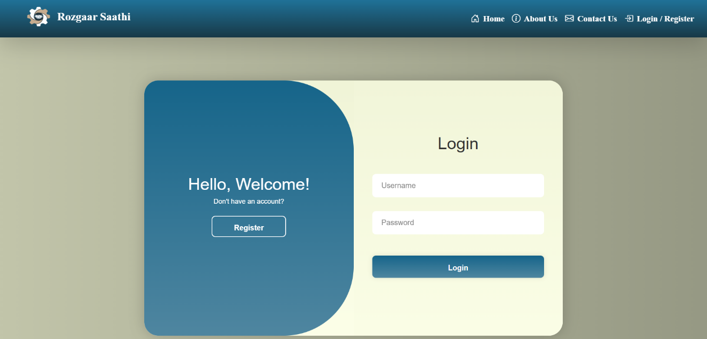
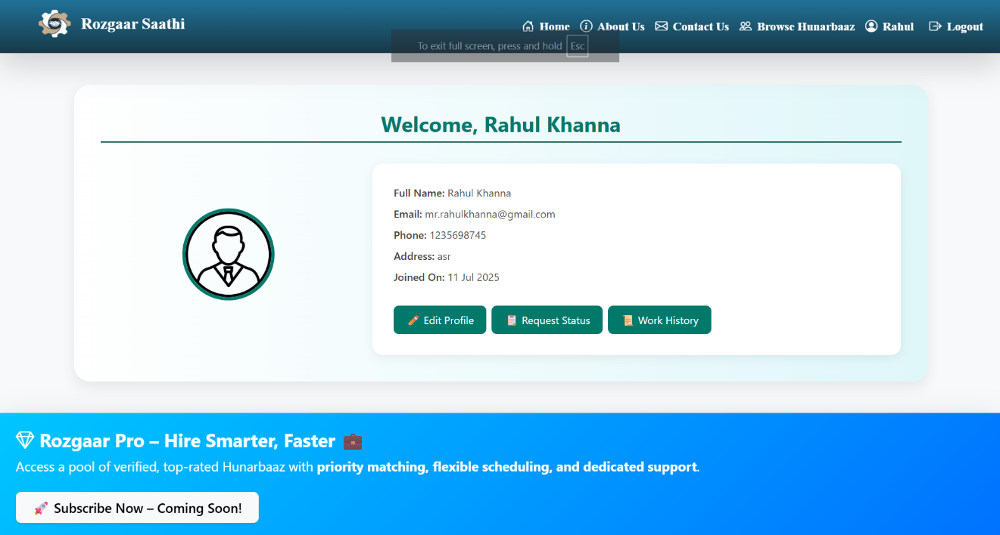
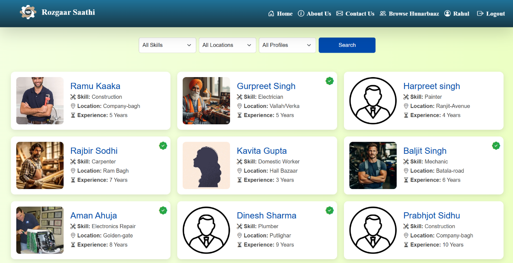
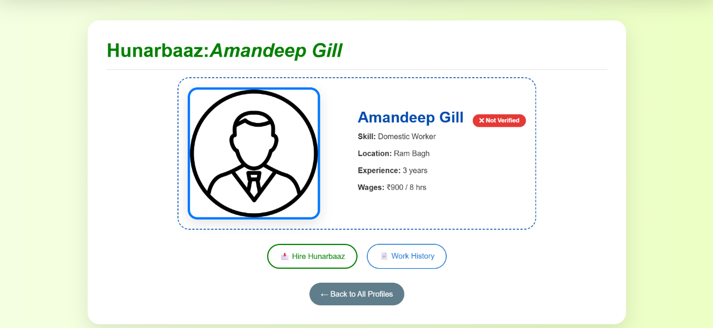
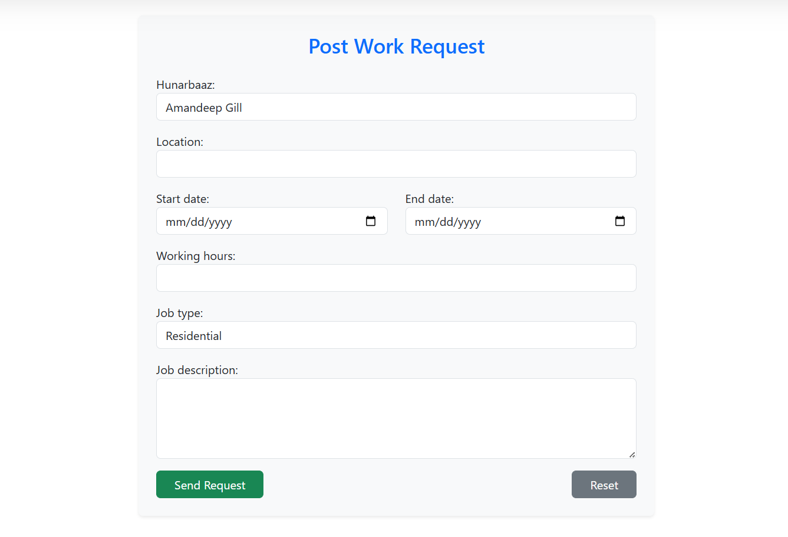
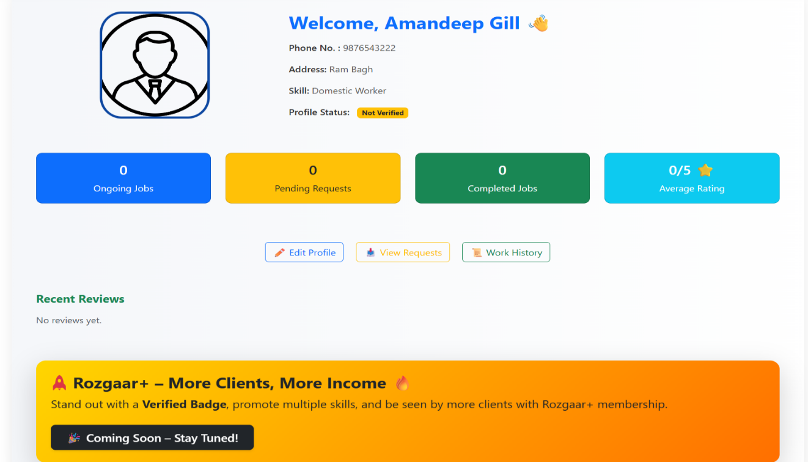

# Rozgaar Saathi
### Your Partner in Skill and Service!

> A Django-based web platform that connects clients with skilled workers and simplifies the process of discovering, requesting, and managing local work services.

## 📌 About the Project

**Rozgaar Saathi** is a web application developed using Django to provide a platform where clients can discover skilled workers, view their profiles, request services, and manage their work requests.

The platform provides separate functionality for **Clients** and **Hunarbaaz (skilled workers)**, along with a dedicated review system.

The project is designed around a simple idea:

**Connect the right client with the right skilled worker.**

## ✨ Key Features

### 👤 Client

* Client registration
* Client profile management
* Search and browse skilled workers
* View Hunarbaaz profiles
* Post work requests
* View request status
* Track request history
* Reschedule requests
* Complete work requests
* Submit reviews

### 🧑‍🔧 Hunarbaaz

* Hunarbaaz registration
* Worker profile management
* Edit profile information
* View received work requests
* Respond to work requests
* Maintain work history
* Display public work history

### ⭐ Reviews

* Dedicated review system
* Review submission
* Review-related pages
* Review management through Django application structure

### 🏠 General

* Responsive web interface
* Reusable base templates
* Separate static resources for applications
* Django-based URL routing
* Database-backed application using SQLite during development


## 🛠️ Technology Stack

| Technology     | Usage                     |
| -------------- | ------------------------- |
| **Python**     | Backend programming       |
| **Django**     | Web application framework |
| **SQLite**     | Development database      |
| **HTML5**      | Page structure            |
| **CSS3**       | Styling and layouts       |
| **JavaScript** | Client-side functionality |
| **Bootstrap**  | UI components and styling |
| **Git**        | Version control           |
| **GitHub**     | Source code hosting       |


## 🏗️ Project Architecture

Rozgaar Saathi follows Django's modular application architecture, with separate applications for common functionality, clients, Hunarbaaz, and reviews.
To view the complete project structure locally:
```bash
tree /f
```

## 🔄 Application Workflow

### Client Workflow

```text
Register
   ↓
Create / Manage Profile
   ↓
Search Hunarbaaz
   ↓
View Worker Profile
   ↓
Post Work Request
   ↓
Track Request
   ↓
Complete / Review Work
```

### Hunarbaaz Workflow

```text
Register
   ↓
Create Profile
   ↓
Receive Work Requests
   ↓
Respond to Requests
   ↓
Complete Work
   ↓
Maintain Work History
```


## 📂 Main Django Applications

### `base`

The `base` application handles the common and general parts of the website, including the home page, authentication-related pages, base templates, static resources, and general views.

### `client`

The `client` application manages client-side functionality such as registration, profiles, searching for Hunarbaaz, posting requests, request history, and request status.

### `hunarbaaz`

The `hunarbaaz` application manages skilled-worker functionality including registration, profiles, received requests, and work history.

### `reviews`

The `reviews` application handles the application's review-related functionality.


## 📸 Screenshots

### 🏠 Home Page


### 🔐 Login & Authentication



### 👤 Client Dashboard



### 🔎 Browse Hunarbaaz



### 🧑‍🔧 Hunarbaaz Profile



### 📋 Work Request



### 🛠️ Hunarbaaz Dashboard




## ⚙️ Installation

### 1. Clone the repository

```bash
git clone https://github.com/yuvraj-sohal/RozgaarSaathi.git
cd ROJGAR_SATHI
```

### 2. Create a virtual environment

Windows:

```bash
python -m venv STP
```

Activate it:

```bash
STP\Scripts\activate
```

### 3. Install dependencies

```bash
pip install -r requirements.txt
```

### 4. Apply migrations

```bash
python manage.py migrate
```

### 5. Create a superuser

```bash
python manage.py createsuperuser
```

### 6. Start the development server

```bash
python manage.py runserver
```

Open the application at:

```text
http://127.0.0.1:8000/
```


## 🔐 Admin Panel

The project uses Django's administration system for administrative management.

After creating a superuser, access the admin panel at:

```text
http://127.0.0.1:8000/admin/
```


## 🗄️ Database

The project currently uses **SQLite** as its development database.

Django migrations are maintained inside the individual applications to manage database schema changes.


## 🚧 Project Status

**Status: Active Development**

The core Django application structure and major user workflows have been implemented. Further improvements can include deployment configuration, enhanced security, UI refinement, testing, and production database configuration.


## 🔮 Future Improvements

Potential future improvements include:

* Production deployment
* PostgreSQL database support
* Improved authentication and authorization
* Email notifications
* Better request tracking
* Advanced worker search and filtering
* Improved review and rating functionality
* Automated testing
* Improved mobile responsiveness
* Production-ready environment configuration
* Performance optimization


## 🎓 Project Type

**Academic / Training Project**

Built as a practical Django web development project to demonstrate full-stack web development, database integration, application architecture, user workflows, and version control.


## 👨‍💻 Developers

### Yuvraj Singh
B.Tech Computer Science & Engineering  
GitHub: [@yuvraj-sohal](https://github.com/yuvraj-sohal)

### Rajbir Singh
B.Tech Computer Science & Engineering  
GitHub: [@er-Rajbir](https://github.com/er-Rajbir)


## 📄 License

This project is intended for educational and portfolio purposes.

A formal open-source license can be added to the repository as the project is prepared for public distribution.
